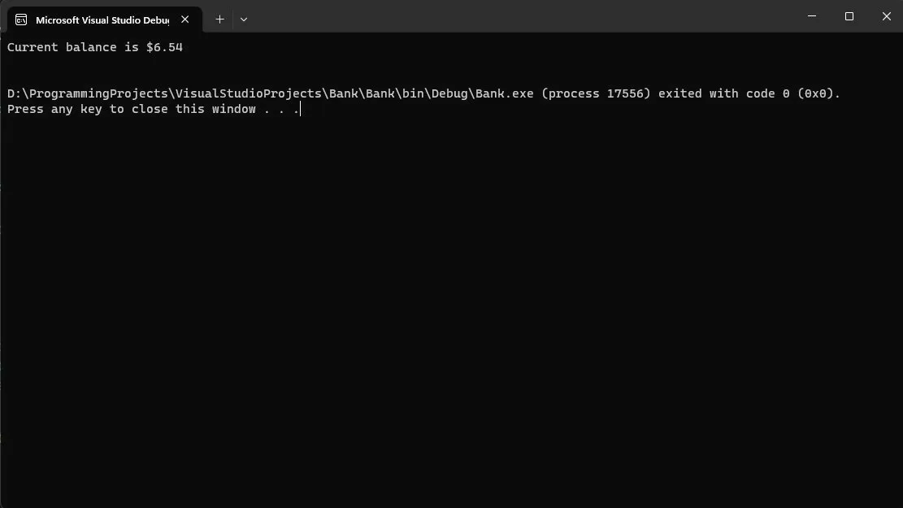
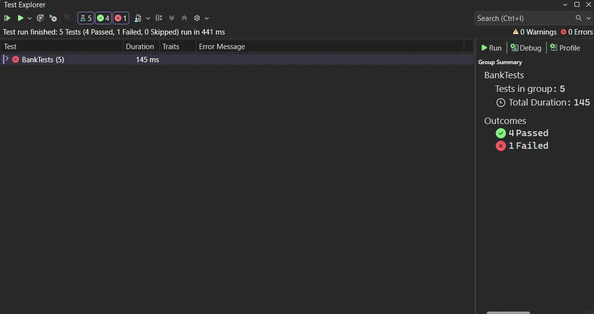
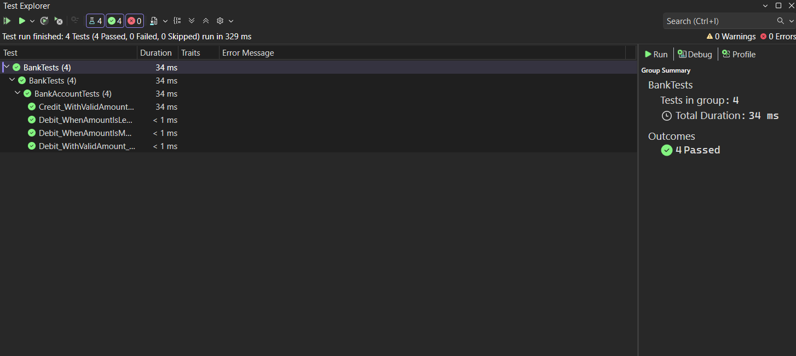

# Практическая работа №6 — Создание автоматизированных Unit-тестов

## Разработчик
* **Студент:** Прокофьев Матвей
* **Группа:** 3ИСИП-123

## Цель работы
Провести тестирование разработанных программных модулей с использованием средств автоматизации Microsoft Visual Studio методом «белого ящика».

---

## Описание проекта

Проект состоит из двух частей:
- **Bank** — консольное приложение с классом `BankAccount`, реализующим операции дебета и кредита банковского счёта
- **BankTests** — проект модульных тестов для класса `BankAccount`

### Основные методы класса BankAccount

- `Debit(double amount)` — снимает денежные средства со счёта. Выбрасывает `ArgumentOutOfRangeException`, если сумма превышает баланс или меньше нуля
- `Credit(double amount)` — зачисляет денежные средства на счёт. Выбрасывает `ArgumentOutOfRangeException`, если сумма меньше нуля

---

## Результат работы приложения

Консольное приложение создаёт банковский счёт с начальным балансом `$11.99`, зачисляет `$5.77` и снимает `$11.22`. Итоговый баланс: `$6.54`.

---

## Тестирование

### Список тестовых методов

| Метод | Описание |
|-------|----------|
| `Debit_WithValidAmount_UpdatesBalance` | Проверяет корректное уменьшение баланса при допустимой сумме дебета |
| `Debit_WhenAmountIsLessThanZero_ShouldThrowArgumentOutOfRange` | Проверяет выброс исключения при отрицательной сумме дебета |
| `Debit_WhenAmountIsMoreThanBalance_ShouldThrowArgumentOutOfRange` | Проверяет выброс исключения при сумме дебета, превышающей баланс |
| `Credit_WithValidAmount_UpdatesBalance` | Проверяет корректное увеличение баланса при допустимой сумме кредита |

### До исправления ошибки (1 тест не пройден)

В исходном коде метода `Debit` была допущена ошибка: вместо вычитания суммы (`m_balance -= amount`) выполнялось её прибавление (`m_balance += amount`), что приводило к некорректному увеличению баланса при снятии средств.

Тест `Debit_WithValidAmount_UpdatesBalance` обнаружил эту ошибку — ожидалось значение `7.44`, но фактически баланс увеличился.

### После исправления ошибки (все тесты пройдены)

После замены `m_balance += amount` на `m_balance -= amount` в методе `Debit` все 4 тестов успешно прошли.

---

## Вывод

В ходе выполнения практической работы был разработан класс `BankAccount` с методами `Debit` и `Credit`, покрытый XML-документацией. С помощью модульного тестирования в Visual Studio была обнаружена ошибка в методе `Debit`: сумма списания прибавлялась к балансу вместо вычитания. После исправления ошибки все 4 теста успешно прошли, что подтверждает корректность работы обоих методов во всех проверяемых сценариях.
